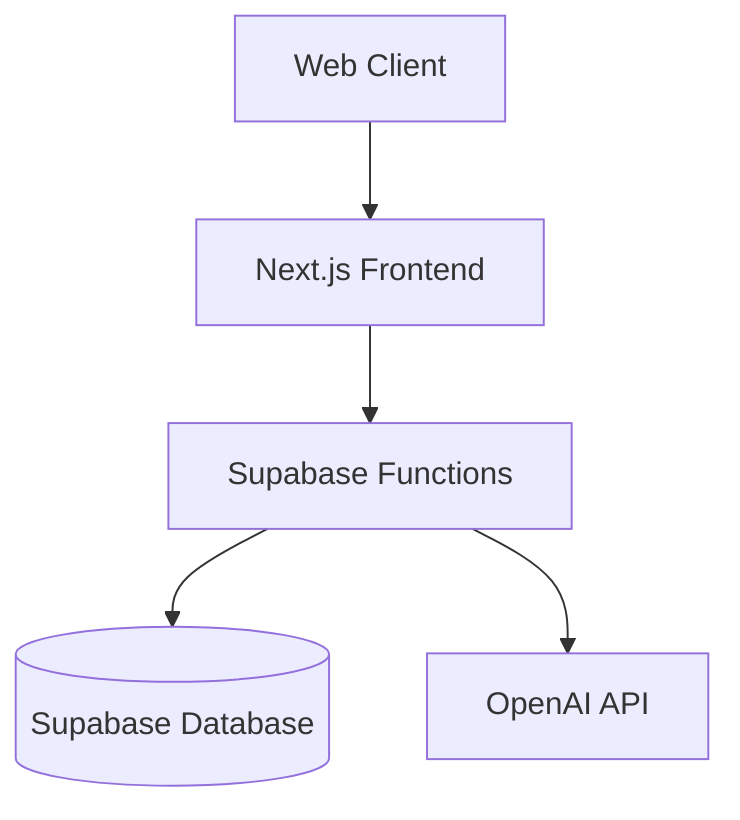

# DrillAI - Geoscience Data Analysis Platform

Author: Muhammad Rizwan

## Overview
DrillAI is an advanced platform for analyzing and visualizing well data, providing AI-powered insights for geoscience analysis. The platform handles geological composition percentages, sonic logs (DT), and gamma ray (GR) measurements across different depths.

## Problem Statement & Requirements

### Business Problem
- Geoscientists need efficient tools to analyze well data
- Manual analysis of geological trends is time-consuming
- Need for real-time insights from complex well data

### Functional Requirements
- Upload and process well composition data
- Interactive visualization of track data
- AI-assisted trend analysis
- Real-time data querying
- Chat-based geological insights

### Non-Functional Requirements
- Scalable data handling
- Sub-second query response
- Secure data storage
- High system availability

## Architecture

### System Components
1. **Frontend (Next.js)**
   - Data visualization dashboard
   - Upload interface
   - Chat interface
   - Well selection & filtering

2. **Backend (Supabase Functions)**
   - RESTful APIs
   - OpenAI integration
   - Authentication
   - Data processing

3. **Database (Supabase PostgreSQL)**
   - Well data storage
   - Track measurements
   - User management



## Implementation

### API Endpoints
```typescript
POST /api/upload/complete  // Upload well track data
GET /api/wells/:wellId/tracks  // Retrieve track data
POST /api/chat  // AI-assisted analysis
```

### Database Schema
```sql
Table: tracks
  well_id: string
  depth: number
  sh_percent: number
  ss_percent: number
  ls_percent: number
  dol_percent: number
  anh_percent: number
  coal_percent: number
  salt_percent: number
  dt: number
  gr: number
```

## Getting Started

### Prerequisites
- Node.js 18+
- Supabase CLI
- OpenAI API key

### Local Development
```bash
# Install dependencies
npm install

# Configure environment
cp .env.example .env
# Add required environment variables:
# SUPABASE_URL=
# SUPABASE_SERVICE_ROLE_KEY=
# OPENAI_API_KEY=

# Start development server
npm run dev
# or
yarn dev

# Start Supabase locally
supabase start
```

Open [http://localhost:3000](http://localhost:3000) with your browser to see the result.

## Deployment

The application is deployed using:
- Frontend: Vercel
- Backend: Supabase Edge Functions
- Database: Supabase PostgreSQL

```bash
# Deploy to production
supabase deploy
vercel deploy
```

## Monitoring & Maintenance

### Monitoring Tools
- Supabase Dashboard
- Vercel Analytics
- Sentry Error Tracking
- Edge Functions Logs

### Maintenance Tasks
- Regular database backups
- Security updates
- API version management
- Performance optimization

## Future Improvements
1. Advanced visualization features
2. Batch data processing
3. Export capabilities
4. Multi-well comparison
5. Custom AI model training

## Learn More

To learn more about Next.js, take a look at the following resources:

- [Next.js Documentation](https://nextjs.org/docs)
- [Learn Next.js](https://nextjs.org/learn)
- [Next.js GitHub repository](https://github.com/vercel/next.js)

## Demo Video
[A comprehensive video walkthrough demonstrating:
1. Data upload workflow
2. Visualization interface
3. AI-assisted analysis
4. Real-time querying
5. System architecture]

## License
None